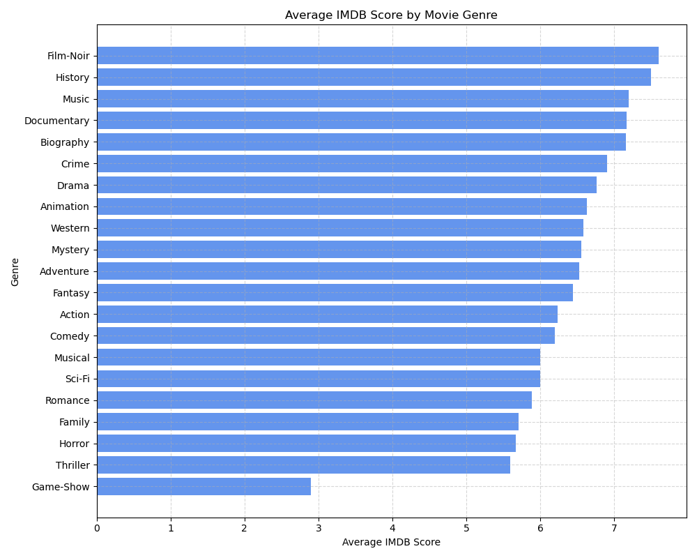
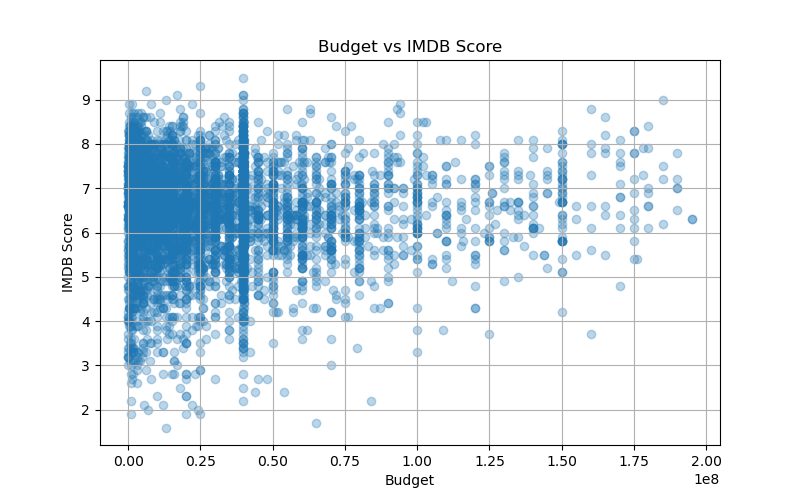
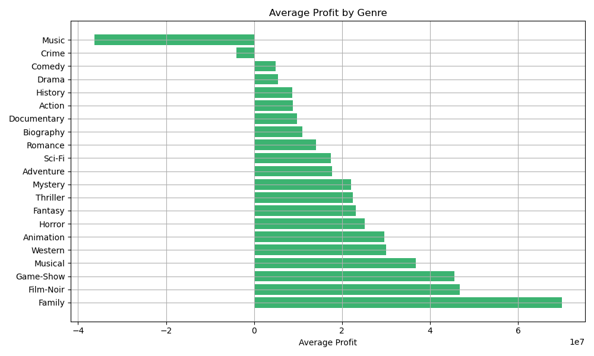

**IMDB Movie Analysis Project**

This project explores movie data from IMDB to uncover trends, assess patterns across genres and directors, and evaluate whether higher budgets correlate with better ratings. The analysis was designed to reflect real-world decision-making processes by applying data cleaning, visualization, and storytelling using Python and pandas.

The project walks through a structured EDA process, from cleaning raw movie data to visualizing trends and summarizing findings in a business-oriented format. The goal is to extract clear, actionable insights that could support data-informed decisions in the entertainment or content industry.

**Project Overview**

Cleaned and prepared the dataset for analysis using pandas
Analyzed variables such as genres, IMDB ratings, director consistency, and budgets
Explored key questions, including:
Which genres dominate the dataset?
Are bigger budgets associated with higher IMDB ratings?
Who are the most consistently high-rated directors?
Created visualizations with matplotlib to support insights and tell a compelling data story

**Tools Used**

Python (for data analysis)
Pandas (for data manipulation and exploration)
Matplotlib (for visualizing key findings)
Jupyter Notebook (as the development environment)

**Dataset in This Project**

movie_metadata.csv: The original dataset
IMDB_Movie_Analysis.ipynb: Main notebook with the full analysis
genre_avg_ratings.png: Visualization of average ratings by genre

**Key Analysis Insights**

-Drama, Comedy, and Action are the most common genres in the dataset.
-Certain directors consistently produce high-rated films, indicating creative reliability.
-There's a very weak correlation (~0.03) between budget and IMDB score — big spending doesn't guarantee audience approval.
-Older films (1950s–1970s) still dominate top-rated lists, showing lasting viewer appreciation.

**Outlier Observations**
Some movies with massive budgets (over $100M) still scored below 5.0, while others with tiny budgets (< $1M) achieved ratings above 9.0 — suggesting that critical success is not purely financial.
findings-
One film with $200M budget earned an IMDB score below 4.5
A movie with < $1M budget scored above 9.0
These outliers highlight the importance of looking beyond averages and detecting unusual patterns when evaluating success.

**Visualization**

**Profitability Analysis**
To identify the most profitable movie genres, we calculated the average profit for each genre by subtracting the average budget from the average gross revenue.
-Family, Film-Noir, and Game-Show genres deliver the highest average profits.
-Genres like Music and Crime show negative or low profits, suggesting poor ROI.
-This insight can help investors or producers target profitable genres.

**Final Summary & Recommendations**

The goal of this project was to explore real-world movie data and uncover what drives audience ratings and profitability across genres, budgets, and directors. By approaching this from a business analytics perspective, I aimed to simulate the kind of insights that can guide investment, production, and content decisions in the film industry.

What I Discovered-

- There is **no strong correlation** between a movie’s budget and its IMDB score, suggesting that **bigger budgets don't guarantee better audience ratings**.
- Genres like **Drama**, **Comedy**, and **Action** appear most frequently, but **Family**, **Film-Noir**, and **Adventure** tend to be **more profitable on average**.
- Some **low-budget films perform exceptionally well**, while some high-budget films underperform — highlighting the importance of content over cost.
- A few **directors consistently produce high-rated movies**, showing that creative leadership matters.

**Recommendation**

- **Focus on high-profit genres** (e.g., Family, Adventure) when prioritizing content for production or investment.
- **Avoid over-relying on budget alone** as a success metric — instead, factor in genre, directorial history, and audience trends.
- Consider **further exploration** using cast influence, marketing data, and audience reviews to build a more complete success model.

